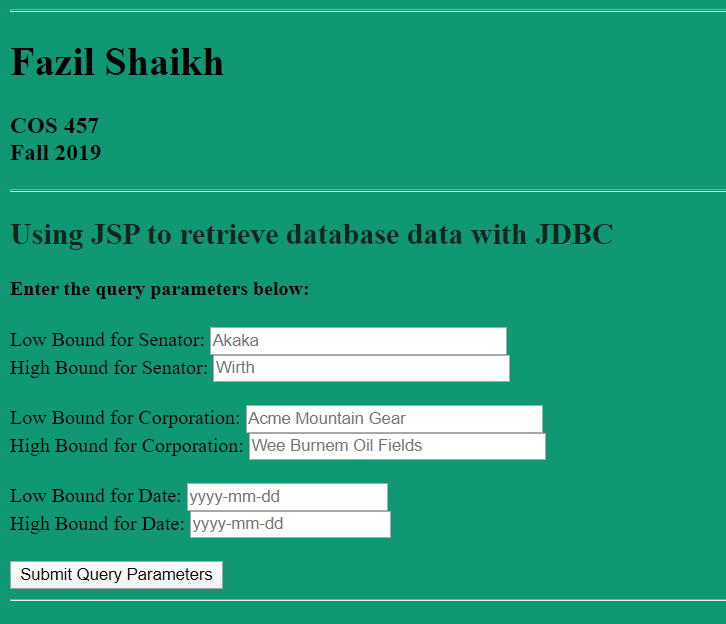

# QueryWebApplication

For this project I implemented a web application that allows the user to query a provided database and displays the results of the query in a table on an html page.

There is an entry html page that gets the query parameter values and submits them to a JSP page that generates the response page and also provides a link back to the entry page.

I used PreparedStatement when taking the parameters for safety and high efficiency.

Apart from the correctness of the query, I also have proper error checking on the server side and there is an appropriate message for each error case. The program has been tested on each of these errors.

